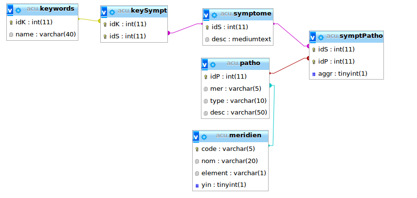

# Projet TLI

* [Initialiser la VM pour les machines à CPE](#initialiser-la-vm-pour-les-machines-à-cpe)
  * [Lancer la VM](#lancer-la-vm)
  * [Installation de docker](#installation-de-docker)
  * [Upgrade de docker-compose](#upgrade-de-docker-compose)
* [Installer le projet](#installer-le-projet)
  * [Récupérer les sources](#récupérer-les-sources)
  * [Lancer la stack docker](#lancer-la-stack-docker)
  * [Déscription des services](#déscription-des-services)
  * [Authentification](#authentification)
* [Générer la documentation PHP](#générer-la-documentation-php)
* [Injection de dépendance](#injection-de-dépendance)
  * [Classe correspondant au service `rs6`](#classe-correspondant-au-service-rs6)
* [Routing](#routing)
  * [Route de fallback (404)](#route-de-fallback-404)
  * [Service de routing](#service-de-routing)
* [Controllers](#controllers)
  * [Récupération des paramètres](#récupération-des-paramètres)
* [Twig](#twig)
* [CSS](#css)
  * [Header](#header)
  * [Grid](#grid)
  * [Miscellaneous](#miscellaneous)
* [Base de données](#base-de-données)

## Initialiser la VM pour les machines à CPE
### Lancer la VM
Sur les PCs de CPE il est nécessaire d'utiliser une VM, docker étant bloqué sur les machines.  
1. Lancer la VM nommée **ubuntu-tli** dans le dossier */softwares/sync/VMs/*
2. Se connecter 
```
Identifiant : tp
Mot de passe : tp
```
### Installation de docker
Passer en super utilisateur
```
su
```
Mettre à jour les packages
```
apt-get update
```
Installer les packages nécessaires pour docker
```
apt-get install \
    apt-transport-https \
    ca-certificates \
    curl \
    gnupg-agent \
    software-properties-common
```
Ajouter les clés GPG de docker
```
curl -fsSL https://download.docker.com/linux/ubuntu/gpg | apt-key add -
```
Ajouter le dépôt docker
```
 add-apt-repository \
     "deb [arch=amd64] https://download.docker.com/linux/ubuntu \
     $(lsb_release -cs) \
     stable"
```
Installer docker
```
apt-get update  
apt-get install docker-ce
```
### Upgrade de docker-compose
*Nous utilisons la version 3 de **docker-compose**, cependant la version présente sur la VM ne supporte pas la version 3, nous devons l'upgrade.*  

Supprimer la version présente
```
rm /usr/bin/docker-compose
```
Installer la version 1.11.1 de **docker-compose**
```
curl -L https://github.com/docker/compose/releases/download/1.11.1/docker-compose-`uname -s`-`uname -m` > /usr/bin/docker-compose
```
Rendre docker-compose executable
```
chmod +x /usr/bin/docker-compose
```
Nous avons installé **docker** et **docker-compose**, nous pouvons donc maintenant installer le projet !

## Installer le projet
### Récupérer les sources
La première étape est de cloner le repository afin d'obtenir les sources du projet, jusqu'ici rien de bien compliqué.  
Pour rappel :
```
SSH : git clone git@github.com:bref-n-m/tli.git
HTTPS : git clone https://github.com/bref-n-m/tli.git
```

### Lancer la stack docker
Nous avons décidé d'utiliser **docker compose** pour gérer les différents services de notre projet.  
Le fichier *docker-compose.yml* se trouvant à la racine du projet nous permet de mettre en place l'environnement de celui-ci.  
Une simple commande et c'est parti !
```
docker-compose up -d
```
Cette commande va lancer les 3 services liés à notre application, à savoir :
- serveur-php
- mysql
- myadmin

### Déscription des services
Nous avons créé un *Dockerfile* pour le service **serveur-php** et un pour **mysql**. Le service **myadmin** quant à lui est basé uniquement sur l'image *phpmyadmin/phpmyadmin*.  
Les différents *Dockerfiles* sont accessibles dans le dossier **services/**.

#### serveur-php
*Lien vers le Dockerfile : **services/php-apache/Dockerfile***  

Ce service est basé sur l'image *php:7.3-apache*, nous avons ensuite ajouté nos différentes configurations et les extentions php que nous utilisons, à savoir les extentions *php_mysql* et *yamL*.  

Ce service écoute sur le port 80 de votre machine. 

#### mysql
*Lien vers le Dockerfile : **services/db/Dockerfile***  

Ce service est basé sur l'image *mysql:5*, nous avons ensuite ajouté le script sql **init.sql** au service pour initiliser la base de données à son lancement.  

Ce service écoute sur le port 3306 de votre machine. 

#### myadmin
Comme dit précédemment ce service est uniquement basé sur l'image *phpmyadmin/phpmyadmin*, nous n'avons pas créé de *Dockerfile* spécifique pour celui-ci.  
Ce service écoute sur le port 8080 de votre machine.

### Authentification

Lors de l'initialisation de la base de données, un utilisateur est créé afin de s'authentifier sur l'application web.

**Identifiants**
```
Email : user@gmail.com
Mot de passe : user07
```
## Générer la documentation PHP
Pour générer la documentation PHP avec [phpDocumentor](https://www.phpdoc.org/), il suffit de lancer la commande `make phpDocumentor`. La documentation se trouvera alors dans le dossier `doc/phpDocumentor/`. Le dossier `Twig/` est exclus de la documentation.

## Injection de dépendance
L'injection de dépendance c'est quoi ?

> Il consiste à créer dynamiquement (injecter) les dépendances entre les différents objets en s'appuyant sur une description (fichier de configuration ou métadonnées) ou de manière programmatique.
[Wikipédia](https://fr.wikipedia.org/wiki/Injection_de_d%C3%A9pendances)

Avec un exemple:

On à une classe `Voiture`, cette classe prend en paramètres de son constructeur:
* $moteur de type `App\Moteur`
* $roues de type `App\Roues`
* $marque de type `string`
* $modele de type `string`

A partir de cette classe on veut définir un service `RS6`, pour ce faire on utilise le fichier de configuration suivant:

```yaml
# /data/www/app/config/DependencyInjection/di.yaml

services:
  rs6:
    class: 'App\Voiture'
    parameters:
      $moteur: '@v8' # on veut injecter le service v8
      $roues: '@18pouces' # on veut injecter le service 18pouces
      $marque: 'Audi'
      $modele: 'RS6'

  v8:
    class: 'App\V8' # App\V8 étend de App\Moteur
    parameters:
      $vis: '@ecrou'

  18pouces:
    class: 'App\18Pouces' # App\V8 étend de App\Roues
    parameters:
      $vis: '@ecrou'
      
  ecrou:
    class: 'App\ecrou'
    parameters:
      $longueur: '20'
```

Ainsi, quand on voudra récuperer le service `rs6`, le système d'injection de dépendance utilisera la configuration définie pour passer au constructeur les bons paramètres.

Les paramètres sont définis sous la clé `parameters`.

Pour injecter un autre service, on le préfixera d'un `@`.

### Classe correspondant au service `rs6`
```php
# /data/www/app/src/App/Voiture.php

<?php

namespace App;

use App\Moteur;
use App\Roues;

class Voiture
{
    /** @var Moteur */
    private $serviceMoteur;
    
    /** @var Roues */
    private $serviceRoues;

    /** @var string */
    private $marque;

    /** @var string */
    private $modele;
    
    public function __construct(Moteur $serviceMoteur, Roues $serviceRoues, string $marque, string $modele)
    {
        $this->serviceMoteur = $serviceMoteur;
        // ...
    }
}
```

On voit donc que si on souhaite créer une `Voiture` avec d'autres paramètres, il suffit de créer un nouveau service.

## Routing
Pour gérer le routing de l'application, un fichier de configuration est nécessaire. Il suit la forme suivante:

```yaml
# /data/www/app/config/Routing/routes.yaml

routes:
  index:
    path: '/'
    controller: 'App\Controller\DefaultController::index'

  complex:
    path: '/some/complex/route/:id-:slug'
    controller: 'App\Controller\DefaultController::complex'
    method: 'POST'
    parameters:
      slug: '[a-zA-Z\-]+' # au moins une lettre minuscule ou majuscule ou caractère -
      id: '\d+' # au moins un chiffre
```

Chaque route est identifiée par son nom `index` et `complex` dans l'exemple.

| Clé | Description |
|:---:| ----------- |
| `path` | Donne l'`uri` de la route |
| `controller` | Une route correspond à une méthode d'un controller. Ainsi, la valeur `App\Controller\DefaultController::index`, précise que la méthode `index` de la classe `App\Controller\DefaultController`, sera utilisé pour la route en question. |
| `method` | La clé method, permet de préciser la méthode d'une route (`GET`, `POST`, ...) |
| `parameters` | Une route peut prendre des paramètres, chaque paramètre est une expression régulière. Le site [regex 101](https://regex101.com/) permet de tester facilement vos expressions régulires.<br>Dans la clé `path`, les paramètres seront préfixés par `:`, exemple pour les paramètres `id` et `slug`: `path: '/some/complex/route/:id-:slug'`<br>Ces paramètres seront ensuite envoyés en paramètres à la méthode du controller, voir [récupération des paramètres](#récupération-des-paramètres) |

### Route de fallback (404)

Pour gérer les pages non trouvées, il est necessaire de créer une route `fallbackRoute`, cette route doit matcher toutes les urls (voir l'exemple suivant).

````yaml
# /data/www/app/config/Routing/routes.yaml

routes:
    # 404 special route
    fallbackRoute:
    path: '/:uri'
    controller: 'App\Controller\ErrorController::notFound'
    parameters:
      uri: '.*'
````

### Service de routing

Un service de routing appelé `router` permet de générer des `uri` vers les actions de l'application, par le biais de la méthode `generatePath(...)`. Cette méthode prend en premier paramètre, le nom de la route, et en second, un tableau correspondant aux paramètres de celle-ci. Voir l'exemple ci-dessous.

```php
/** @var Router $router */
$router = $this->get('router'); // recupération du service router.

$uri = $router->generatePath('complex', [
  'id'   => 123,
  'slug' => 'salut-ca-va',
]);
```

## Controllers
Les pages de notre application correspondent chacunes à une action d'un controller.

Chaques action doit retourner un objet de type `Beaver\Response\Response`.

La méthode `$this->render('template.html.twig', ['parameter' => 'lorem'] /* tableau à passer à twig */);` renvoit un objet `Beaver\Response\Response`. Elle peut donc être utilisée par une action pour rendre une template twig (voir l'exemple ci-après).

Dans le cas de web service, vous pouvez renvoyer une `Beaver\Response\JsonResponse` (qui étend de `Beaver\Response\Response`) (voir l'exemple ci-après).

```php
# /data/www/app/src/App/Controller/DefaultController.php

<?php

namespace App\Controller;

use App\Salut;
use Beaver\Controller\AbstractController;
use Beaver\Response\JsonResponse;
use Beaver\Response\Response;
use Beaver\Router;

class DefaultController extends AbstractController
{
    public function index()
    {
        return $this->render('index.html.twig', [
            'name' => 'Beaver',
        ]);
    }

    public function complex(string $slug, int $id)
    {
        /** @var Router $router */
        $router = $this->get('router'); // Récupération du service 'router'

        return new JsonResponse([
            'id'    => $id,
            'slug'  => $slug,
            'route' => $router->generatePath('complex', [
                'id'   => 123,
                'slug' => 'salut-ca-va',
            ])
        ]);
    }
}
```

### Récupération des paramètres

Les paramètres sont récupérés par une action en paramètres, ex: `public function complex(string $slug, int $id)`.

## Twig

Tous les fichiers twig se trouvent dans le répertoire `/data/www/app/src/App/templates/`

Les fonctions suivantes, ont étés recrées pour notre architecture, et doivent être utilisées:
* `asset()` :arrow_right: pour charger les fichiers statiques présent dans `/data/www/app/public/`
* `path()` :arrow_right: pour créer un lien vers une action (utilise le service `router`, voir [service de routing](#service-de-routing))

Exemple d'utilisation de ces méthodes:
``` twig
<html>
<head>
    <link rel="stylesheet" href="{{ asset('style.css') }}"> {# vient chercher le fichier style.css dans le dossier /data/www/app/public/ #}
</head>
<body>

<p>Hi {{ name }}</p>
{# créé un lien vers l'action complex et avec les paramètres id à 12 et slug à coucou #}
<p><a href="{{ path('complex', {'id': '12', 'slug': 'coucou'}) }}">Complex route</a></p> 
<br>

</body>
</html>
```

Twig est installé en version 2.8.1.

[Doc de twig](https://twig.symfony.com/doc/2.x/)

## CSS

Les fichiers de style se trouvent dans ‘App/Public/Style‘.
* Le fichier ‘header' correspond à l'en-tête / Nav bar
* Le fichier ‘grid' correspond au principe de grille
* Le fichier ‘miscellaneous' correspond au reste du style

### Header
La nav bar est faite de façon a être responsive.
En effet, toutes les pages sont accessibles quand l'écrane est en grand, autrement il y a un menu sur la gauche qui se glisse pour selectionner la page.

Pour se faire, nous avons implémenté le CSS et un peu de javascript (Jquery)

### Grid
Nous utilisons un standard de largeur de 12 colonnes. Cette grille aide à l'organisation de la page et de la rendre esthétique.
``` twig
<div class="row">
    <div class="col-s-6 col-m-3">
        ...
    </div>
    <div class="col-s-3 col-m-1">
        ...
    </div>
    <div class="col-s-3 col-m-1">
        ...
    </div>
</div>
```

Différentes tailles :
* S -> Small Screen
* M -> Medium Screen
* L -> Large Screen

La plus petite taille est maitre.

Il est aussi possible de pousser, de rendre visible ou non et de centrer les div

```CSS
.col-s-push-0,.col-s-push-1,
.col-s-center,
.col-s-hidden,
.col-s-show
```
 
### Miscellaneous

Utilisation de bloc, avec ou sans footer possible

``` twig
<div class="card">
    <div class="card-header">
        Card Title
    </div>
    <div class="card-body">
        Lorem ipsum dolor sit amet, consectetuer adipiscing elit, sed diam nonummy nibh euismod tincidunt ut laoreet dolore magna aliquam erat volutpat. Ut wisi enim ad minim veniam, quis nostrud exerci tation ullamcorper suscipit lobortis nisl ut aliquip
        ex ea commodo consequat.
    </div>
    <div class="card-footer">
        Card Footer
    </div>
</div>
```

Utilisation de bouton, en variant son importance :
``` twig
    <button class="button warning">Warning</button>
    <button class="button danger">Danger</button>
    <button class="button light">Light</button>
    <button class="button success">Success</button>
    <button class="button info">Info</button>
    <button class="button secondary">Secondary</button>
```

## Base de données



Schéma de la base de données initiale.

[Script de la base de données initiale](http://github.com/bref-n-m/tli/blob/develop/doc/script/db.sql)
